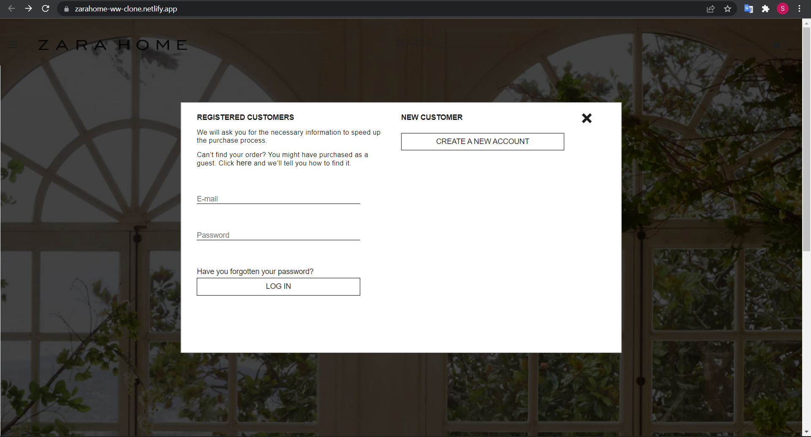

# ZARA HOME CLONE  

This project is made for educational purpose only.

**Project Link -** [ZARA HOME CLONE](https://zarahome-ww-clone.netlify.app/)

## About Us:

For the 3rd unit of our curriculum at Masai School, we learned about vanilla Javascript and some other tools.

To apply these learning outcomes we got a chance to work upon this project. Here we built various functionalities to clone the Zara Home website.  

## About ZARA HOME: 

Zara Home is a company that belongs to the Spanish Inditex group dedicated to the manufacturing of home textiles. It was created in 2003. It has around 408 stores in 44 countries. The company focuses on retailing various housewares.

## Tech-Stacks & Tools:

* HTML
* CSS
* VANILLA JAVASCRIPT
* LOCAL STORAGE

## Features:
 
* Signin and Signup page
* Sidebar,Popups
* Sort Filter
* Responsive Cartpage

## Glimpse of our project:

1. Landing Page

2. Singin Page

3. Singup Page

4. Product Page

5. Product-Details Page

6. Cart Page

7. Delivery Page

8. Payment Page 

9. Summary Page 

10. Thankyou Page 

## Our Team:

  1. [Surendra Kumar Rout](https://github.com/SurendraKumarRout)
  2. [Nagendra Muralidhar Pulla](https://github.com/nag-murali) 
  3. [Kundan Kunmar ](https://github.com/vaibhav123-dev) 
  4. [Shaik Akbar Basha](https://github.com/mujhusain) 
  5. [Jenish Kathrotiya](https://github.com/JKAD02) 
  
  
